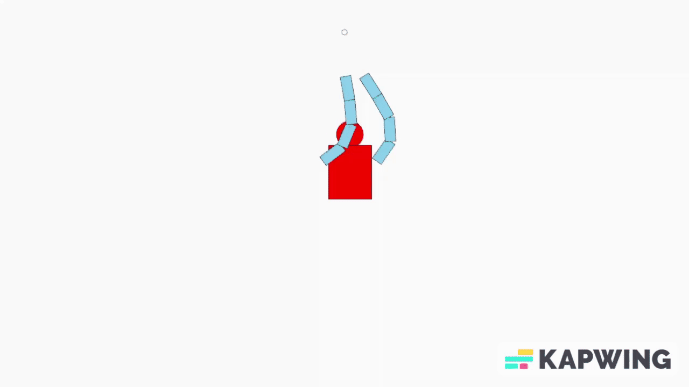
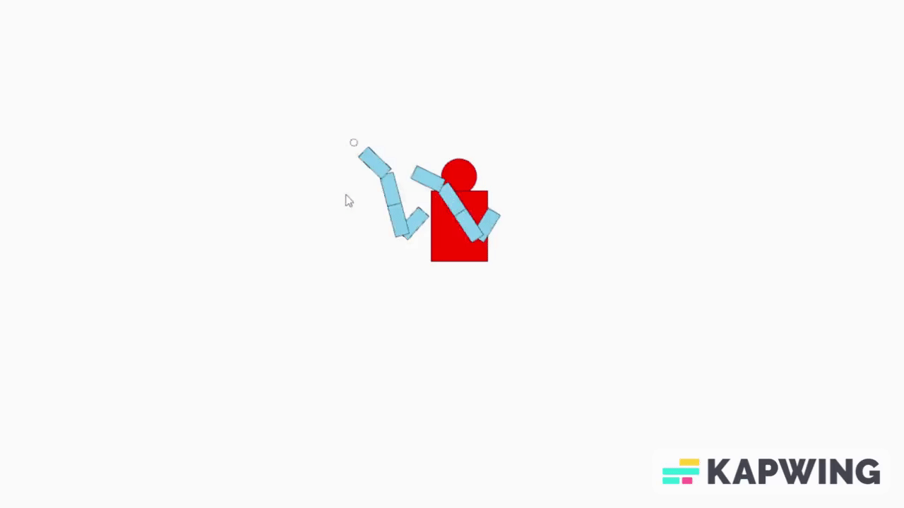
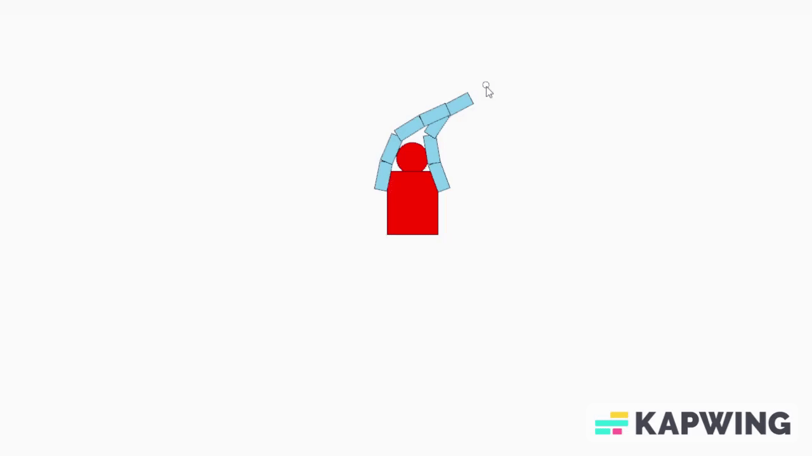

# Features

## Multi-arm IK
I designed Two arms IK with a total of 8 joints based on the algorithm we talked about in class.
  
## Join limit
I limit the speed of the arm, so there will have a speed limit for the arms that follow the mouse. 

### with Limit
  
### Without limit
  

## User Interaction
The user can hold the mouse button to make the arms follow the mouse.

## Moving IK
Using the w,a,s,d key can make the arms move in different directions in a stable speed.
  

## Difficulties
The difficulty that I have faced during this project is to handle multiple arms. So, I change the design of the solve() function. My solve() function have input of the start and the root vector. So if I want to add an extra arm. I just need to add the arm's angle, start and root vector and call solve() again.

## Part 2 Fabrik
I make a single fabrik arm in the fabrik folder, I think implementing fabrik is easier than the algorithm in the course once you understand fabrik. 
I think fabrik perform better because I think fabrik's simulation is more natural 
  

## Extra tools
I did not use any extra tools
